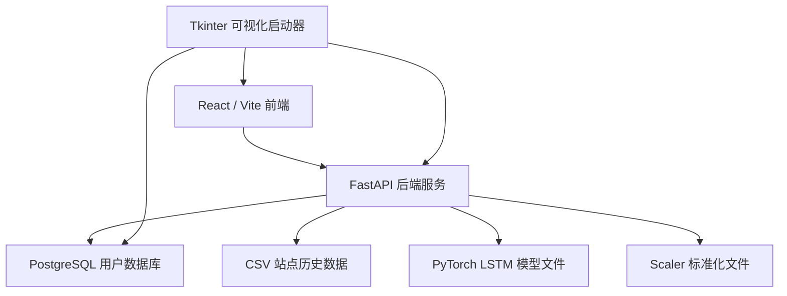

<div align="center">

# 🌫️ PM2.5 监控预警平台

**基于 FastAPI + React/Vite + PostgreSQL + PyTorch LSTM 的空气质量预测与污染预警系统**


</div>

---

## 📌 项目简介

PM2.5 监控预警平台是一个面向空气质量监测、PM2.5 多日预测、污染等级判断和模型管理的毕业设计项目。

系统采用前后端分离架构：

- **前端**：React + Vite，负责首页、登录注册、预测页面、管理员页面和图表展示。
- **后端**：FastAPI，负责站点数据读取、特征工程、模型加载、预测推理、用户认证和管理员模型管理。
- **数据库**：PostgreSQL，保存用户账号、角色等基础信息。
- **模型层**：PyTorch LSTM，支持普通多变量模型、特征增强模型和预警导向模型。
- **启动器**：Tkinter 桌面启动器，支持一键启动前后端、数据库配置、数据库验证和实时日志查看。

---

## ✨ 功能特性

### 1. 站点数据管理

- 读取 `data/raw/pm25_sites/` 下的站点 CSV 文件
- 自动识别常见 CSV 编码：
  - `utf-8-sig`
  - `utf-8`
  - `gbk`
  - `gb2312`
- 自动完成：
  - 日期字段标准化
  - 数据排序
  - 重复日期去重
  - 数值字段转换
  - 缺失值前向 / 后向填充
- 支持上传新的站点 CSV 数据

### 2. PM2.5 预测

系统使用 LSTM 模型进行未来多日 PM2.5 预测，默认预测未来 7 天。

内置模型配置包括：

| 模型 Key | 模型名称 | 输入特征数 | 说明 |
|---|---|---:|---|
| `old_direct7` | 普通多变量 LSTM | 6 | 使用基础污染物指标预测 |
| `featured_direct7` | 特征增强 LSTM | 21 | 加入时间周期、滞后、滑动均值、差分特征 |
| `featured_warning_direct7` | 预警导向特征增强 LSTM | 21 | 面向污染等级预警优化 |

### 3. 特征工程

基础污染物特征：

```text
pm25, pm10, o3, no2, so2, co
```

时间周期特征：

```text
month_sin, month_cos, day_sin, day_cos
```

滞后特征：

```text
pm25_lag1, pm25_lag3, pm25_lag7, pm10_lag1, co_lag1
```

滑动均值特征：

```text
pm25_roll3, pm25_roll7, pm10_roll3, co_roll3
```

差分特征：

```text
pm25_diff1, pm10_diff1
```

### 4. 污染等级与预警

系统根据预测 PM2.5 浓度自动生成空气质量等级和预警建议：

| PM2.5 浓度 | 空气质量等级 |
|---:|---|
| `≤ 35` | 优 |
| `35 ~ 75` | 良 |
| `75 ~ 115` | 轻度污染 |
| `115 ~ 150` | 中度污染 |
| `150 ~ 250` | 重度污染 |
| `> 250` | 严重污染 |

### 5. 用户与管理员

- 用户注册
- 用户登录
- 普通用户 / 管理员角色区分
- 管理员登录入口
- 管理员模型管理
- 模型启用 / 禁用 / 隐藏
- 管理员训练模型参数补全
- 自定义模型接入扩展

### 6. 可视化启动器

`start_all.py` 提供桌面端启动器，支持：

- 一键启动后端 FastAPI
- 一键启动前端 Vite
- 一键停止 / 重启服务
- 实时显示前后端运行日志
- 显示端口、PID、访问地址和系统状态
- 自动检查 Python、npm、node_modules、端口占用
- 配置 PostgreSQL 数据库连接信息
- 保存数据库配置到 `.env`
- 启动前验证数据库连接
- 支持 PyInstaller 打包为 EXE

---

## 🧱 技术架构



---

## 🧰 技术栈

| 模块 | 技术 |
|---|---|
| 前端框架 | React |
| 前端构建 | Vite |
| 路由 | react-router-dom |
| 网络请求 | axios |
| 图表 | echarts |
| 后端框架 | FastAPI |
| ASGI 服务 | uvicorn |
| 数据处理 | pandas、numpy |
| 模型推理 | PyTorch |
| 模型与 scaler 加载 | joblib |
| 数据库 | PostgreSQL |
| 数据库驱动 | psycopg2-binary |
| 启动器 | Tkinter、subprocess、threading |
| 版本管理 | Git / GitHub |

---

## 📁 项目结构

```text
final-program/
├── backend/                         # 后端 FastAPI 与模型推理逻辑
│   ├── alert/                       # 预警相关模块
│   ├── config/                      # 后端配置
│   ├── model/                       # LSTM 模型与 scaler 文件
│   ├── utils/                       # 工具函数
│   ├── __init__.py
│   ├── admin_api.py                 # 管理员与模型管理接口
│   ├── app.py                       # FastAPI 主入口
│   ├── auth.py                      # 认证相关逻辑
│   ├── data_loader.py               # 数据读取模块
│   ├── data_preprocess.py           # 数据预处理模块
│   ├── db.py                        # 数据库连接模块
│   ├── init_db.py                   # 数据库初始化
│   ├── models.py                    # 数据模型
│   ├── requirements.txt             # 后端基础依赖
│   ├── schemas.py                   # 请求 / 响应结构
│   └── timeseries_builder.py        # 时间序列构造模块
│
├── config/                          # 项目级配置
├── data/
│   ├── raw/
│   │   └── pm25_sites/              # 站点 CSV 数据
│   └── predictions/                 # 预测结果输出目录
│
├── frontend/                        # React / Vite 前端
│   ├── src/
│   │   ├── api/                     # 前端接口封装
│   │   │   └── backend.js
│   │   ├── components/              # 图表、导航、站点选择等组件
│   │   ├── pages/                   # 首页、登录、预测、管理员页面
│   │   ├── App.jsx                  # 前端路由入口
│   │   └── main.jsx                 # React 挂载入口
│   ├── package.json
│   └── vite.config.js
│
├── logs/                            # 日志目录
├── notebooks/                       # 实验与模型训练 Notebook
├── scripts/                         # 辅助脚本
├── tests/                           # 测试目录
├── .env.example                     # 数据库环境变量示例
├── .gitignore
├── start_all.py                     # 可视化一键启动器
└── README.md
```

---

## ⚙️ 环境要求

### 基础环境

- Python 3.10+
- Node.js 18+
- npm 9+
- PostgreSQL 12+
- Git

### Python 推荐依赖

项目中的后端 `app.py` 使用了 FastAPI、PostgreSQL、Pandas、NumPy、PyTorch、Joblib 等库。建议在虚拟环境中安装：

```bash
pip install fastapi uvicorn psycopg2-binary python-multipart sqlalchemy passlib[bcrypt]
pip install pandas numpy scikit-learn joblib torch
```

也可以先安装后端依赖文件：

```bash
pip install -r backend/requirements.txt
```

如果启动时报缺少 `pandas`、`torch`、`joblib`、`sklearn` 等模块，再按上方推荐依赖补装。

---

## 🔐 数据库配置

项目使用 PostgreSQL。

根目录已经提供 `.env.example`：

```env
DB_HOST=localhost
DB_PORT=5432
DB_NAME=db1
DB_USER=postgres
DB_PASSWORD=请在本地填写
```

首次运行时，复制一份为 `.env`：

```bash
copy .env.example .env
```

然后修改 `.env`：

```env
DB_HOST=localhost
DB_PORT=5432
DB_NAME=db1
DB_USER=postgres
DB_PASSWORD=你的数据库密码
```

`.env` 中包含数据库密码，禁止提交到 GitHub。项目 `.gitignore` 已配置忽略 `.env`。

---

## 🚀 快速启动

### 方式一：使用可视化启动器，推荐

在项目根目录执行：

```bash
python start_all.py
```

启动器操作顺序建议：

```text
填写数据库信息 → 保存配置 → 验证数据库 → 环境检查 → 启动全部 → 打开系统
```

默认访问地址：

| 服务 | 地址 |
|---|---|
| 前端页面 | http://localhost:5173 |
| 后端接口 | http://127.0.0.1:8000 |
| 后端文档 | http://127.0.0.1:8000/docs |

---

### 方式二：手动启动后端

进入项目根目录：

```bash
cd final-program
```

创建虚拟环境：

```bash
python -m venv .venv1
```

激活虚拟环境：

```powershell
.\.venv1\Scripts\Activate.ps1
```

安装依赖：

```bash
pip install -r backend/requirements.txt
pip install pandas numpy scikit-learn joblib torch
```

启动后端：

```bash
uvicorn backend.app:app --reload --port 8000
```

---

### 方式三：手动启动前端

进入前端目录：

```bash
cd frontend
```

安装依赖：

```bash
npm install
```

启动开发服务器：

```bash
npm run dev
```

浏览器访问：

```text
http://localhost:5173
```

---

## 📡 主要接口

### 用户注册

```http
POST /api/register
```

请求示例：

```json
{
  "username": "user01",
  "password": "123456",
  "role": "user"
}
```

### 用户登录

```http
POST /api/login
```

请求示例：

```json
{
  "username": "user01",
  "password": "123456"
}
```

### 获取站点列表

```http
GET /stations
```

兼容接口：

```http
GET /api/stations
```

### PM2.5 预测

```http
POST /predict
```

兼容接口：

```http
POST /api/predict
```

请求示例：

```json
{
  "station": "changchun",
  "model_key": "featured_direct7",
  "days": 7,
  "history_days": 14
}
```

返回内容通常包括：

- 站点信息
- 模型信息
- 历史 PM2.5 数据
- 未来 PM2.5 预测结果
- 污染等级
- 预警提示
- 长期拟合数据
- 预测结果 CSV 输出路径

### 上传 CSV

```http
POST /upload_csv
```

兼容接口：

```http
POST /api/upload_csv
```

---

## 📄 CSV 数据格式

CSV 至少应包含以下字段：

```text
date, pm25, pm10, o3, no2, so2, co
```

字段兼容说明：

| 原字段 | 标准字段 |
|---|---|
| `pm2.5` | `pm25` |
| `pm_25` | `pm25` |
| `pm2_5` | `pm25` |
| `日期` | `date` |
| `时间` | `date` |

示例：

```csv
date,pm25,pm10,o3,no2,so2,co
2024-01-01,45,70,32,28,12,0.8
2024-01-02,52,81,30,31,13,0.9
2024-01-03,38,60,35,26,11,0.7
```

---

## 🧠 模型文件说明

模型和 scaler 默认放在：

```text
backend/model/
```

典型文件包括：

```text
lstm_pm25_changchun_old_direct7.pt
lstm_pm25_changchun_featured_direct7.pt
lstm_pm25_changchun_featured_warning_direct7.pt

scaler_pm25_old_direct7.save
scaler_pm25_featured_direct7.save
scaler_pm25_featured_warning_direct7.save
scaler_pm25_featured_warning.save
```

后端加载模型时会自动处理：

- `state_dict`
- `model_state_dict`
- `state_dict`
- `weights`
- `DataParallel` 的 `module.` 前缀
- `torch.compile` 的 `_orig_mod.` 前缀
- 根据权重自动反推：
  - `input_size`
  - `hidden_size`
  - `num_layers`
  - `pred_days`

这样可以降低模型结构参数和权重文件不一致导致的加载失败风险。

---

## 🖥️ 启动器说明

`start_all.py` 是项目的一键启动器，适合毕业设计演示和本地部署。

### 启动器主要能力

| 功能 | 说明 |
|---|---|
| 启动后端 | 自动执行 `uvicorn backend.app:app --reload --port 8000` |
| 启动前端 | 自动执行 `npm run dev -- --host 0.0.0.0` |
| 端口检测 | 检测 8000 和 5173 是否被占用 |
| 日志窗口 | 实时显示前端和后端输出 |
| 状态显示 | 显示运行状态、PID、端口、访问地址 |
| 数据库配置 | 支持填写 PostgreSQL 主机、端口、库名、用户、密码 |
| 数据库验证 | 启动前测试 PostgreSQL 是否能连接 |
| 自动打开浏览器 | 前端启动成功后自动打开系统页面 |
| 打包支持 | 可用 PyInstaller 打包为 `.exe` |

### 打包为 EXE

```bash
pip install pyinstaller
pyinstaller -F -w start_all.py -n PM25Launcher
```

打包后建议将生成的 EXE 放在项目根目录，即与 `backend/`、`frontend/` 同级。

---

## 🧪 前端页面

前端路由包括：

| 路由 | 页面 |
|---|---|
| `/` | 首页 |
| `/login` | 用户登录 |
| `/register` | 用户注册 |
| `/admin-login` | 管理员登录 |
| `/prediction` | PM2.5 预测页面 |
| `/admin` | 管理员后台 |

主要组件包括：

- `Navbar.jsx`
- `Footer.jsx`
- `SiteSelector.jsx`
- `HistoricalChart.jsx`
- `FutureChart.jsx`
- `ModelComparison.jsx`

---

## 🛠️ 常见问题

### 1. 后端启动失败：数据库连接错误

检查：

- PostgreSQL 服务是否启动
- `.env` 中数据库信息是否正确
- 数据库是否已创建
- 启动器中“验证数据库”是否通过

### 2. 前端启动失败：找不到 node_modules

进入 `frontend` 目录执行：

```bash
npm install
```

### 3. 模型加载失败：size mismatch

常见原因：

- 模型训练时的 `hidden_size` 与当前加载结构不一致
- 模型输入特征数和 scaler 特征数不一致
- 模型文件和 scaler 文件不匹配

解决方向：

- 确认模型对应的 `model_key`
- 确认 `.pt` 和 `.save` 是同一训练流程生成
- 查看后端返回的模型加载错误详情

### 4. CSV 读取失败

检查 CSV 是否包含：

```text
date, pm25, pm10, o3, no2, so2, co
```

并确认日期字段可以被 Pandas 正确解析。

### 5. GitHub 上没有模型文件

项目 `.gitignore` 默认忽略：

```text
*.pt
*.pth
*.save
```

因此模型文件不会自动上传 GitHub。运行预测前，请手动把模型和 scaler 放入：

```text
backend/model/
```

---

## 📦 GitHub 使用建议

### 首次提交

```bash
git init
git add .
git commit -m "initial commit"
git branch -M main
git remote add origin https://github.com/你的用户名/你的仓库名.git
git push -u origin main
```

### 后续更新

```bash
git add .
git commit -m "update project"
git push
```

### 大模型文件

如果需要上传 `.pt`、`.pth`、`.save` 等模型文件，建议使用 Git LFS：

```bash
git lfs install
git lfs track "*.pt"
git lfs track "*.pth"
git lfs track "*.save"
git add .gitattributes
git add backend/model
git commit -m "add model files with git lfs"
git push
```

---

## 📷 系统截图

建议在仓库中新建：

```text
docs/images/
```

然后添加截图：

```markdown


```

---

## 👨‍💻 作者

**田宇栋**

项目方向：PM2.5 空气质量预测、污染等级预警、LSTM 时间序列建模、前后端可视化系统。

---

## 📄 License

本项目主要用于毕业设计、课程设计、学习研究和本地演示场景。

如需公开发布或商业使用，请根据实际情况补充开源许可证。
